# TimeSeriesAnalysis_Of_Ecommerce_Data
A Time series analysis of e-commerce company's(MercadoLibre) financial and user data.To help company's growth we predict company's searh traffic and see if it can be translated into the ability to sccessfully translate the stock. Our analysis is divided into five seactions as follows:

1. Finding unusual patterns in hourly Google search traffic  
2. Mining the search traffic data for seasonality
3. Relating the search traffic to stock price patterns
4. Creating a time series model with Prophet
5. Forecasting revenue by using time series models

---
## Technologies

This application works on python 3.7 and uses following libraries:

* [pystan](https://pystan.readthedocs.io/en/latest/getting_started.html) - PyStan is a Python interface to Stan, a package for Bayesian inference. Stan® is a state-of-the-art platform for statistical modeling and high-performance statistical computation. The major dependency that Prophet has is pystan

* [fbprophet](https://facebook.github.io/prophet/) - Prophet is open source software released by Facebook’s Core Data Science team. It is a procedure for forecasting time series data based on an additive model where non-linear trends are fit with yearly, weekly, and daily seasonality, plus holiday effects.

* [hvplot](https://hvplot.holoviz.org/user_guide/Introduction.html) - A component of PyViz ecosystem used for creating Interactive Visualizations of data.

* [holoviews](https://holoviews.org/getting_started/Introduction.html) - HoloViews is an open-source Python 2 and 3 library for data analysis and visualization.

---
## Installation Guide

Follow the following instructions before using the application.

```python
  pip install pystan
  pip install fbprophet
  pip install hvplot
  pip install holoviews
```
---
## Usage

Upload the **forecasting_net_prophet.ipynb** file in **[colab](https://colab.research.google.com/)** and start running the code. Upload the mentioned data files in the comment section of that code bloack located in **Resources** folder as and when the code block is executed.


---
## Detailed Explanation

1. ### Finding unusual patterns in hourly Google search traffic  
To see if the Google search traffic for the company links to any financial events at the company or to see if the search traffic data just present random noise we are finding out any unusual patterns in the Google search data for the company and connecting them to the corporate financial events.

1. Reading the search data into a DataFrame, and then slicing the data to the month of May 2020. (During this month, MercadoLibre released its quarterly financial results.) Use hvPlot to visualize the results.

  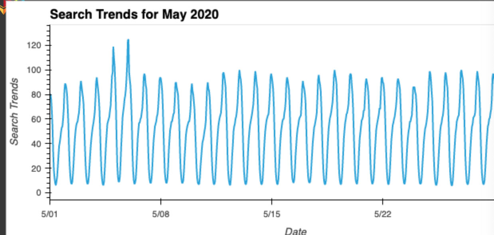
  
2. Calculating the total search traffic for the month, and then comparing the value to the monthly median across all months. 

  
  
  
  
  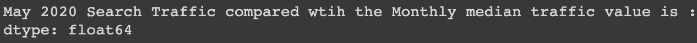
  
  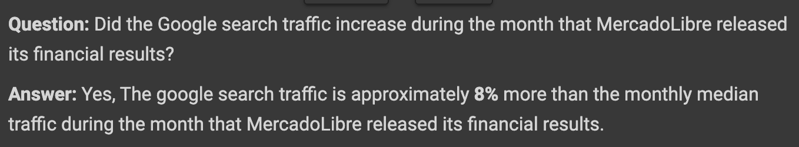

---
2. ### Mining the search traffic data for seasonality

To get a greater return on investment(ROI) from the company's marketing budget we are mining the search traffic for predictable seasonal patterns of interest in the company which will help them to focus their marketing efforts during the most traffic. To do so, we follow the below steps : 

1. Search Data is grouped to plot the average traffic by the day of the week (for example, Monday vs. Friday).

  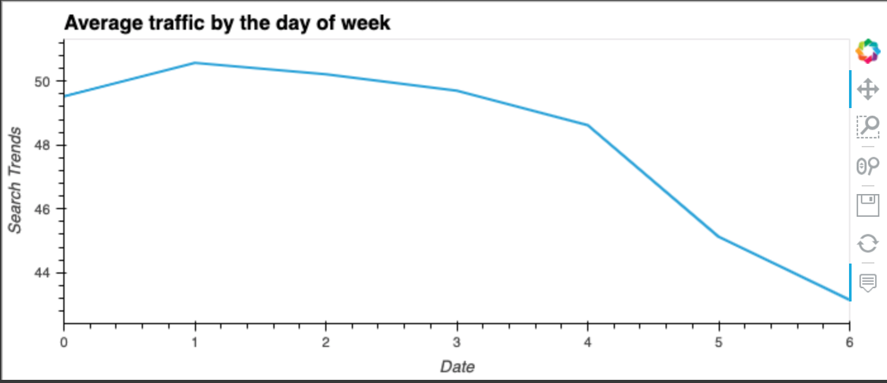

2. Using hvPlot, visualizing traffic as a heatmap, referencing the index.hour as the x-axis and the index.dayofweek as the y-axis.

  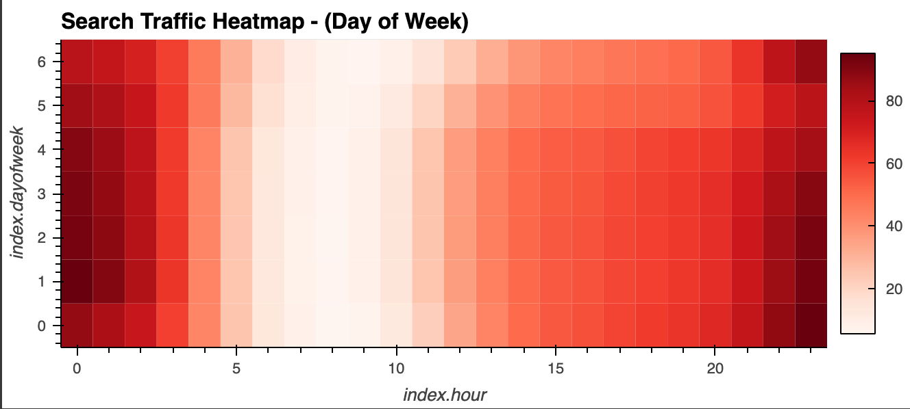
  
  

3. Search data is grouped by the week of the year.

  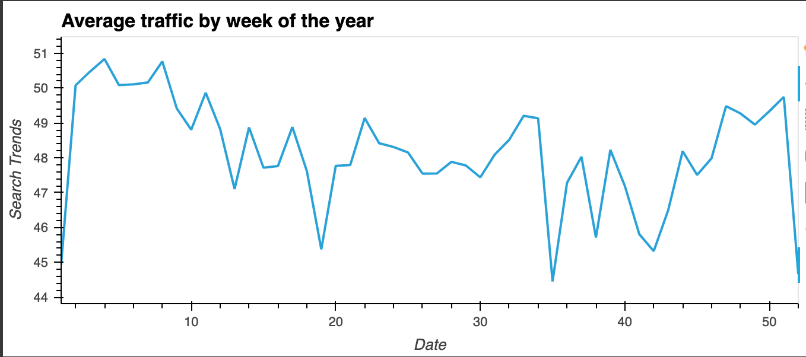

  

---
3. ### Relating the search traffic to stock price patterns

Investigating if there is any relationship between the search data and the company's stock prices. To do so, we follow the below steps :

1. Reading and plotting the stock price data. Concatenating the stock price data to the search data in a single DataFrame.

 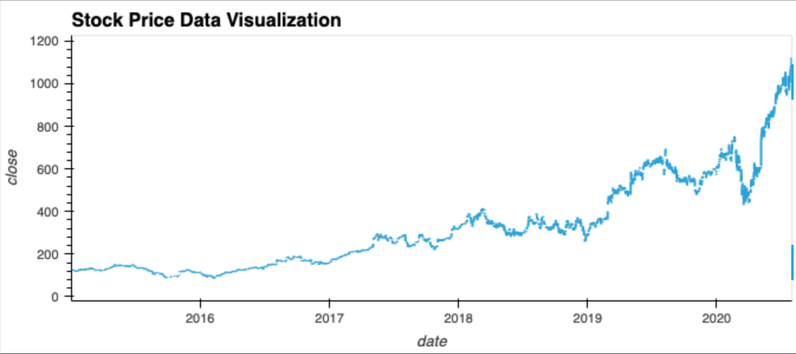

2. Analyzing the market events occured during the year 2020 and analyzing company's stocks for that event

 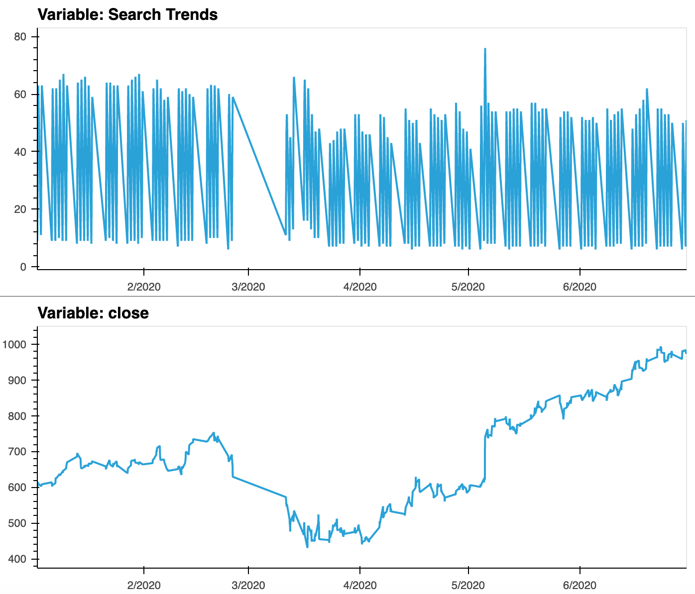
 
 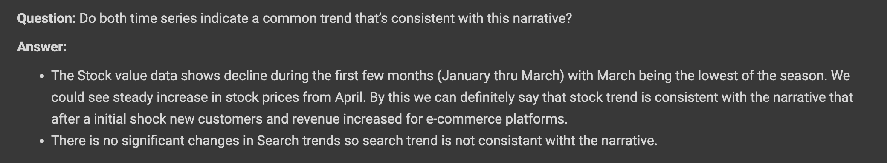

3. Creating a three new columns in the DataFrame named:

  * “Lagged Search Trends”, which holds value that offsets, or shifts, the search traffic by one hour.

  * “Stock Volatility”, which holds an exponentially weighted four-hour rolling average of the company’s stock volatility

  * “Hourly Stock Return”, which holds the percent change of the company's stock price on an hourly basis

4. Reviewing the time series correlation.

 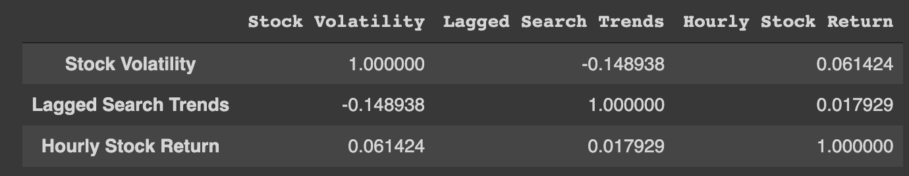

 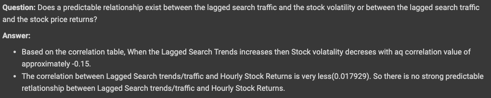

---
4. ### Creating a time series model with Prophet
Using Prophet  we create a time series model that analyzes and forecasts patterns in the hourly search data. To do so, we follow the below steps :

1. Setting up the Google search data for a Prophet forecasting model.

2. Plotting the search forecast.

 
 
 

3. Plotting the individual time series components of the model.
  
 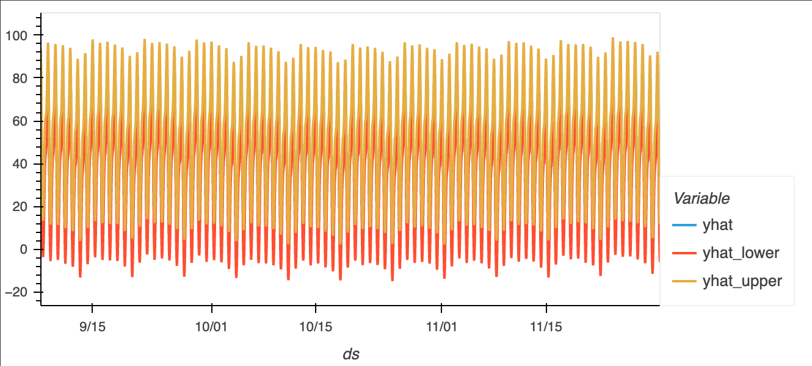

 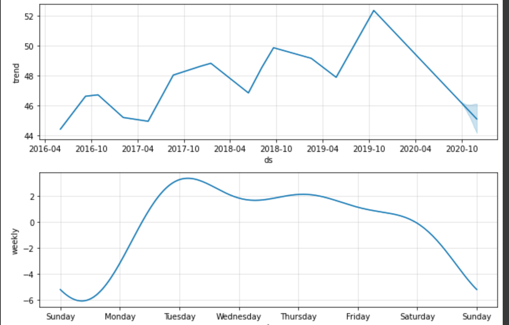

 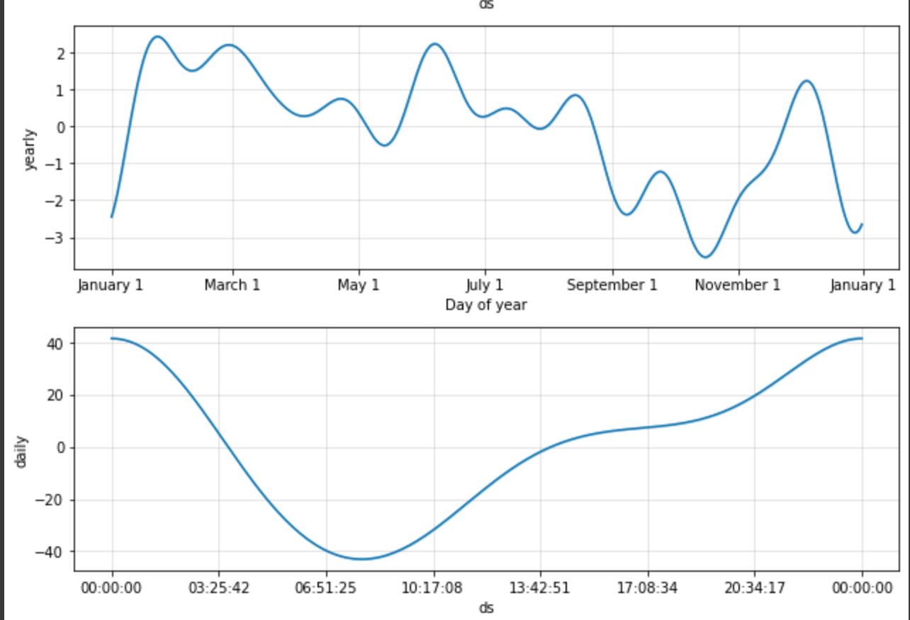

 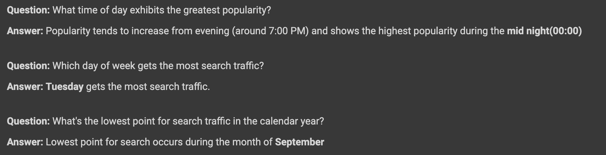

---
5. ### Forecasting revenue by using time series models

Using Prophet we create a time series model that analyzes and forecasts the total sales for the next quarter using the company's financial data. To do so, we follow the below steps :

1. Reading the daily historical sales (that is, revenue) figures, and then applying a Prophet model to the data. The daily sales figures are quoted in millions of USD dollars.

 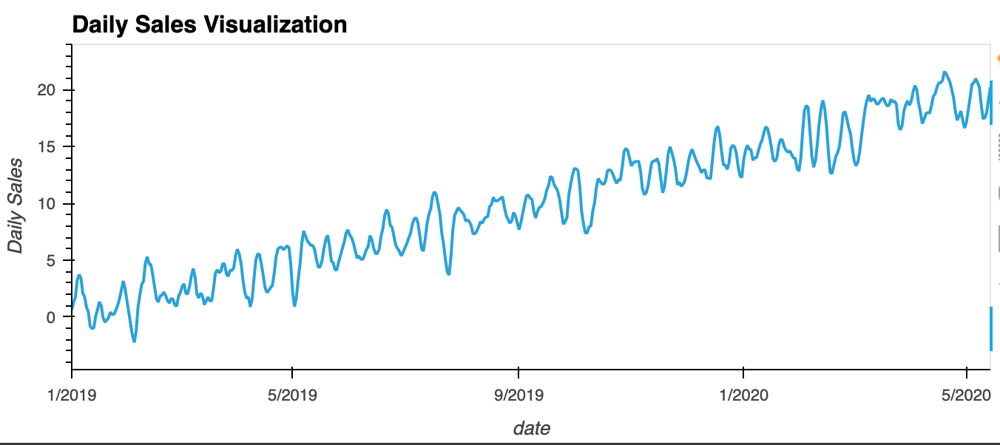

2. Interpretting the model output to identify any seasonal patterns in the company's revenue.

 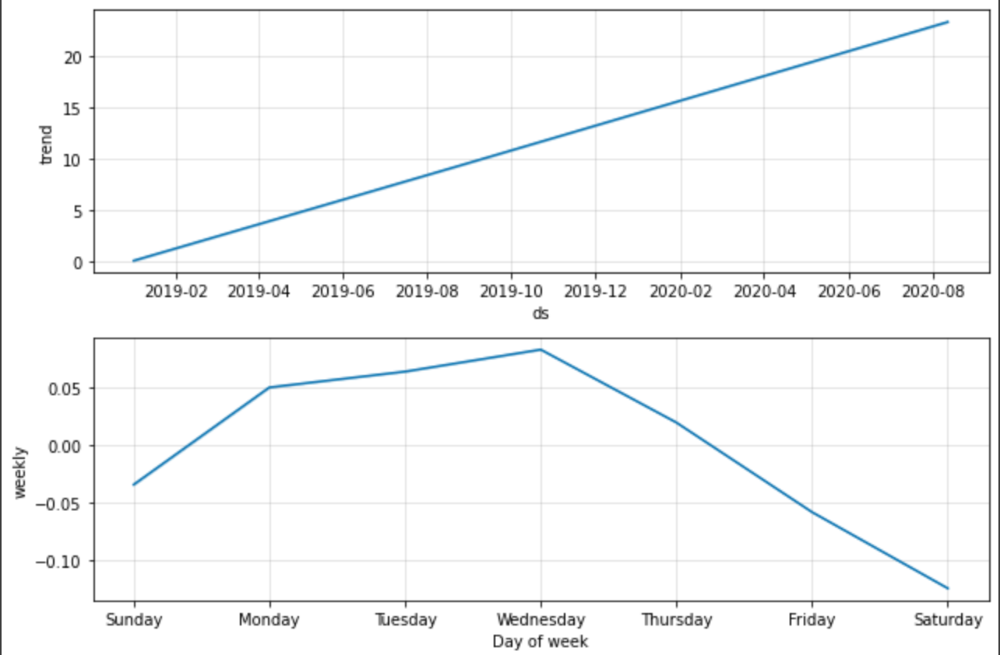

 

3. Producing a sales forecast for the finance group.

 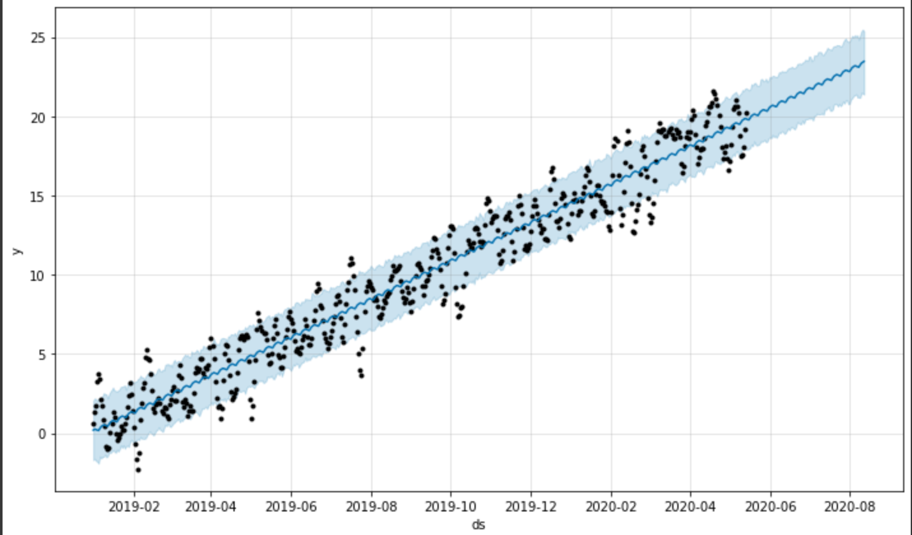

 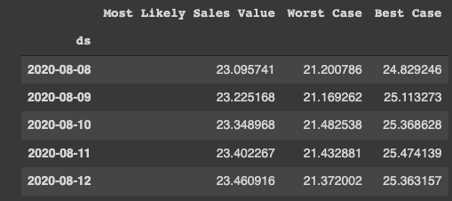

 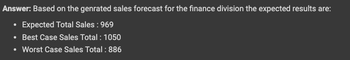

---

